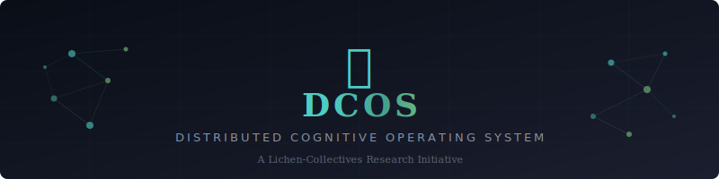

**S.P.O.R.E. — Symbiotic Prompting & Ontological Routing Engine** is the project name.

<p align="center">
  
</p>

<h1 align="center">🧠 DCOS — Distributed Cognitive Operating System is the architecture in project atm.</h1>

<p align="center">
  <em>An open-source fractal architecture for augmenting LLM reasoning<br/>through distributed, modular, and self-routing cognitive profiles.</em>
</p>

<p align="center">
  <a href="#the-problem">The Problem</a> •
  <a href="#the-insight">The Insight</a> •
  <a href="#how-it-works">How It Works</a> •
  <a href="#architecture">Architecture</a> •
  <a href="#why-fractal">Why Fractal</a> •
  <a href="#theoretical-foundations">Foundations</a> •
  <a href="#roadmap">Roadmap</a> •
  <a href="CONTRIBUTING.md">Contribute</a>
</p>

<p align="center">
  
  
  
</p>

---

## What if AI could choose *how* to think — not just *what* to say?

Large Language Models are extraordinarily powerful pattern machines. But they reason the same way regardless of the task — a flat, stateless stream of token predictions. They don't adapt their cognitive strategy. They don't specialize. They don't compose reasoning structures the way biological intelligence does.

**DCOS changes that.**

DCOS is an open architecture that externalizes cognitive strategies into modular, versionable, community-contributed repositories — and lets the LLM dynamically navigate between them based on what it encounters. It transforms static prompting into a living, self-routing cognitive ecosystem.

> *"We don't teach the model what to think. We teach it where to go to learn how to think about this specific kind of problem."*

---

## The Problem

Current approaches to enhancing LLM reasoning — Chain of Thought, Tree of Thoughts, Self-Refine — share a fundamental limitation: **they are monolithic.** A single prompting strategy is applied uniformly, regardless of whether the task demands analytical decomposition, creative divergence, ethical deliberation, or adversarial stress-testing.

This is equivalent to asking a human to use the same mental process for debugging code, writing poetry, diagnosing a patient, and navigating a moral dilemma. Humans don't do this. We have specialized cognitive modes that we **switch between fluidly** based on what we encounter.

The research community has recognized this. Google DeepMind's **Self-Discover** (NeurIPS 2024) showed that letting LLMs self-select reasoning modules yields up to 32% improvement over Chain of Thought. Peking University's **Buffer of Thoughts** (NeurIPS 2024 Spotlight) demonstrated that reusable thought-templates reduce compute costs by 88% while improving accuracy.

But both approaches store everything locally, within a single context window or a single system.

**What if we distributed it?**

---

## The Insight

The core insight of DCOS comes from an unexpected source: **lichenology.**

Lichens are not single organisms. They are symbiotic collectives — fungi, algae, and bacteria operating as a unified system where each partner contributes a specialized capability. No central controller. No single point of failure. Just modular, cooperative intelligence that has thrived for 400 million years.

DCOS applies this principle to AI cognition:

- Each **cognitive profile** is an autonomous, specialized reasoning module (a "symbiont")
- The **routing system** is the symbiotic interface that connects them (the "mycobiont network")
- The **LLM** is the substrate on which this distributed cognition operates (the "thallus")
- **GitHub** is the decentralized infrastructure that hosts, versions, and distributes the intelligence (the "substrate")

The result is an AI system that doesn't just generate text — it **navigates a cognitive landscape**, selecting and composing reasoning strategies in real-time.

---

## How It Works

### The Journey of a Query

```
    ┌──────────────────────────────────────────────────────────────┐
    │                         USER QUERY                           │
    │              "How should we design a resilient               │
    │               food distribution network for                  │
    │               remote northern communities?"                  │
    └──────────────────────┬───────────────────────────────────────┘
                           │
                           ▼
    ┌──────────────────────────────────────────────────────────────┐
    │                    🧭 CORTEX (Root Router)                   │
    │                                                              │
    │   Reads the query → Classifies along dimensions:             │
    │     • Task type: systemic design                             │
    │     • Complexity: 0.85                                       │
    │     • Ambiguity: 0.6                                         │
    │     • Domains: logistics, ecology, social systems            │
    │                                                              │
    │   Routes to: cognitive-systems/ (primary)                    │
    │              cognitive-ecological/ (secondary)                │
    └──────────────────────┬───────────────────────────────────────┘
                           │
              ┌────────────┴────────────┐
              ▼                         ▼
    ┌──────────────────┐    ┌──────────────────────┐
    │ 🔬 SYSTEMS       │    │  🌿 ECOLOGICAL       │
    │    PROFILE        │    │     PROFILE           │
    │                   │    │                        │
    │ Phases:           │    │ Phases:                │
    │ • Map components  │    │ • Biomimetic scan      │
    │ • Find feedback   │    │ • Symbiosis patterns   │
    │   loops           │    │ • Resilience analysis   │
    │ • Stress-test     │    │                        │
    │   topology        │    │ Sub-routes to:         │
    │                   │    │ → cognitive-ethical/    │
    │ Detects: ethical  │    │   (food sovereignty)   │
    │ dimension         │    │                        │
    │ Sub-routes to:    │    └──────────┬─────────────┘
    │ → cognitive-      │               │
    │   ethical/        │               │
    └────────┬──────────┘               │
             │         ┌────────────────┘
             ▼         ▼
    ┌──────────────────────────────────────────────────────────────┐
    │                   ⚖️ ETHICAL PROFILE                         │
    │                                                              │
    │   Loaded by BOTH parent profiles (convergence point)         │
    │   Phases:                                                    │
    │   • Stakeholder mapping                                      │
    │   • Value tension analysis                                   │
    │   • Weighted deliberation                                    │
    │                                                              │
    │   Returns ethical constraints to both parent profiles        │
    └──────────────────────┬───────────────────────────────────────┘
                           │
                           ▼
    ┌──────────────────────────────────────────────────────────────┐
    │                    🧭 CORTEX (Synthesis)                     │
    │                                                              │
    │   Merges outputs from all activated profiles                 │
    │   Applies KERNEL Ω introspection (adversarial self-test)    │
    │   Generates calibrated final response                        │
    └──────────────────────────────────────────────────────────────┘
```

Notice what happened: two profiles independently recognized an ethical dimension and both routed to the same ethical sub-profile. The system **converged naturally** on the need for ethical reasoning — not because it was hardcoded, but because the routing conditions in both profiles detected it. This is emergent cognitive behavior.

---

## Architecture

### The Three Layers

```
╔══════════════════════════════════════════════════════════════════╗
║                                                                  ║
║   LAYER 1 — THE CORTEX (Root Repository)                        ║
║   ─────────────────────────────────────                          ║
║   The cognitive router. Classifies incoming queries and          ║
║   dispatches them to the appropriate cognitive profile(s).       ║
║   Contains the master routing table and merge strategies.        ║
║                                                                  ║
║   One repo. The entry point. The "prefrontal cortex."            ║
║                                                                  ║
╠══════════════════════════════════════════════════════════════════╣
║                                                                  ║
║   LAYER 2 — COGNITIVE PROFILES (Satellite Repositories)         ║
║   ──────────────────────────────────────────────────             ║
║   Specialized reasoning modules, each in its own repo.           ║
║   Contains: system prompt, phases, few-shot examples,            ║
║   sub-routing rules, and validation tests.                       ║
║                                                                  ║
║   Many repos. Independently maintained. Community-contributed.   ║
║                                                                  ║
╠══════════════════════════════════════════════════════════════════╣
║                                                                  ║
║   LAYER 3 — THE INTERFACE STANDARD (Protocol)                   ║
║   ────────────────────────────────────────────                   ║
║   The JSON schema that all profiles must implement.              ║
║   Ensures interoperability between any cognitive profile         ║
║   and any LLM runtime. The "synaptic protocol."                  ║
║                                                                  ║
║   One specification. Universal. Model-agnostic.                  ║
║                                                                  ║
╚══════════════════════════════════════════════════════════════════╝
```

### What Lives in Each Cognitive Profile

Every cognitive profile repository follows the same self-similar structure:

```
cognitive-[name]/
│
├── MANIFEST.json              ← Identity card: what this profile does,
│                                 when to activate it, where it can route
│
├── system_prompt.md           ← The specialized reasoning instructions
│
├── phases/                    ← Ordered cognitive steps for this profile
│   ├── 01_cartography.json
│   ├── 02_divergence.json
│   └── 03_synthesis.json
│
├── few_shots/                 ← Introspective examples (showing error → correction)
│   ├── example_01.json
│   └── example_02.json
│
├── sub_routes/                ← Conditions that trigger navigation to other profiles
│   └── routing_rules.json
│
└── tests/                     ← Validation: input → expected cognitive behavior
    ├── test_01.json
    └── test_02.json
```

**The fractal property**: this structure is identical at every depth level. A sub-profile loaded by another profile has the same architecture. A sub-sub-profile loaded three levels deep has the same architecture. Self-similarity all the way down.

---

## Why Fractal

The term "fractal" is not metaphorical here. It describes a precise structural property of the system.

### Self-Similarity Across Scales

| Scale | Structure | Function |
|-------|-----------|----------|
| **Macro** (Cortex) | Router → Profiles → Sub-profiles | Cognitive task decomposition |
| **Meso** (Profile) | Phases → Steps → Sub-steps | Reasoning pipeline execution |
| **Micro** (Phase) | Observe → Hypothesize → Test → Refine | Scientific method at each step |

At every level of magnification, you find the same pattern: **classify → route → specialize → synthesize**. This is not an accident. It mirrors how biological neural systems organize — from brain regions down to individual neurons, the same motif of integration and specialization repeats.

### Why This Matters

Fractal architectures have a unique property: **they scale without redesign.** Adding a new cognitive profile doesn't require restructuring the system. It simply attaches to the existing tree at whatever depth is appropriate, like a new branch growing from a fractal fern. The routing protocol handles discovery automatically.

This is also why we chose Git as the substrate. Git's branching model is itself fractal — branches spawn branches spawn branches, with merge operations that reunify divergent paths. The version control metaphor maps perfectly onto cognitive evolution: try a new reasoning strategy (branch), test it (CI), merge it if it works (pull request), roll back if it doesn't (revert).

---

## Theoretical Foundations

DCOS synthesizes insights from seven peer-reviewed frameworks:

| Framework | Key Contribution to DCOS | Source |
|-----------|--------------------------|--------|
| **Chain of Thought** | Traceable step-by-step reasoning within each phase | Wei et al., 2022 |
| **Tree of Thoughts** | Parallel hypothesis generation in divergence phases | Yao et al., NeurIPS 2023 |
| **Graph of Thoughts** | Cross-branch fusion and non-linear reasoning paths | Besta et al., AAAI 2024 |
| **Self-Discover** | Dynamic self-selection of reasoning modules (Phase 0) | Zhou et al., NeurIPS 2024 |
| **Buffer of Thoughts** | Reusable thought-templates and meta-buffer architecture | Yang et al., NeurIPS 2024 Spotlight |
| **Self-Refine / Reflexion** | Iterative self-critique and correction loops | Madaan 2023 / Shinn 2023 |
| **Self-Consistency** | Multi-path validation through convergence | Wang et al., ICLR 2023 |

### Original Contributions

Beyond synthesis, DCOS introduces three novel concepts:

**1. Introspective Few-Shot Prompting**
Standard few-shot shows the model successful examples. DCOS shows the model the *complete cognitive process* — including the initial error, the moment of self-diagnosis, and the correction. This teaches the model *how to doubt* rather than *what to conclude.*

**2. Distributed Cognitive Routing**
No prior framework distributes reasoning strategies across independent, versionable, community-maintainable repositories. DCOS treats cognitive profiles as microservices in a reasoning architecture.

**3. Fractal Cognitive Recursion**
The ability for a cognitive profile to invoke another cognitive profile — to arbitrary but bounded depth — creates emergent reasoning capabilities that no single profile possesses alone.

---

## The Lichen Principle

> *In nature, the most resilient systems are not the strongest individuals — they are the most cooperative collectives.*

This project is part of the [Lichen-Collectives](https://github.com/lichen-collectives) research initiative, which explores how principles from symbiotic biology can inform the design of distributed, resilient, and cooperative technological systems.

The name "lichen" is not branding. It is the architectural thesis:

- **Modularity without isolation** — Each component is autonomous yet deeply integrated
- **Resilience through redundancy** — If one cognitive profile fails, others compensate
- **Emergent capability** — The collective produces reasoning that no individual component could achieve
- **Design for descent** — The system remains functional as infrastructure degrades, just as lichens thrive where other organisms cannot

---

## Roadmap

DCOS is currently in the **research and design phase**. No code has been written yet — intentionally. We believe that cognitive architecture must be thoroughly designed before implementation, just as a building's blueprint must be complete before construction begins.

### Phase 1 — Foundation (Current)
- [x] Core theoretical framework (KERNEL Ω)
- [x] Architecture specification
- [x] Community presentation (this document)
- [ ] JSON schema specification for MANIFEST.json
- [ ] Interface protocol documentation

### Phase 2 — Seed Profiles
- [ ] First cognitive profiles: analytical, creative, adversarial, systems, ethical
- [ ] Introspective few-shot libraries for each profile
- [ ] Validation test suites

### Phase 3 — Cortex Router
- [ ] Root routing logic implementation
- [ ] Multi-profile merge strategies
- [ ] Fractal recursion with depth control

### Phase 4 — Runtime Integration
- [ ] MCP (Model Context Protocol) server implementation
- [ ] API integration layer (OpenAI, Anthropic, local models)
- [ ] RAG-enhanced cognitive profiles

### Phase 5 — Ecosystem
- [ ] Community contribution guidelines for new profiles
- [ ] Profile quality certification process
- [ ] Cross-pollination: profiles that learn from each other's outputs

---

## Who This Is For

**Researchers** exploring structured reasoning, prompt engineering, or cognitive architectures for AI systems. DCOS provides a testable, modular framework for experimenting with reasoning strategies.

**Developers** building LLM-powered applications that require domain-specific reasoning. Instead of crafting monolithic system prompts, plug in the appropriate cognitive profile.

**The curious** who believe that the next leap in AI capability isn't just bigger models — it's smarter *architecture around* models.

---

## Contributing

DCOS is an open research project. We welcome contributions at every level:

- **Theoretical**: Propose new cognitive modules, routing strategies, or architectural improvements
- **Empirical**: Test existing profiles against benchmarks and report results
- **Creative**: Design cognitive profiles for domains we haven't imagined yet
- **Critical**: Find the flaws. Break the assumptions. The adversarial profile exists for a reason — we apply it to ourselves first.

See [CONTRIBUTING.md](CONTRIBUTING.md) for guidelines.

---

## A Note on Philosophy

DCOS is not an attempt to create artificial general intelligence. It is an attempt to create **artificial cognitive diversity** — to give AI systems access to multiple specialized ways of reasoning, and the ability to choose between them.

We believe that intelligence — biological or artificial — is not a single capability but an ecosystem of capabilities. The most profound insights come not from thinking harder along one dimension, but from **connecting** different modes of thought.

A physicist sees a network problem through the lens of frustrated geometries. An ecologist sees it through symbiotic relationships. An ethicist sees it through stakeholder tensions. None of them is wrong. All of them are incomplete. The complete picture emerges only at the intersection.

DCOS is designed to hold that intersection.

---

<p align="center">
  <strong>DCOS is a Lichen-Collectives project</strong><br/>
  <em>Distributed intelligence, cooperative by design.</em>
</p>

<p align="center">
  <a href="https://github.com/lichen-collectives">GitHub</a> •
  <a href="docs/VISION.md">Full Vision Document</a> •
  <a href="docs/ARCHITECTURE.md">Technical Architecture</a>
</p>
